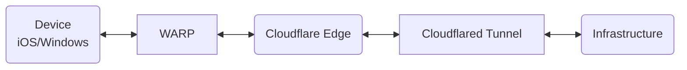

# Environment

1. AlmaLinux 9.6 (Sage Margay) <!-- Change to Fedora -->
2. Zellij
3. tmux
4. Cloudflared


## Install tmux

```bash
sudo dnf -y install tmux
```

## Install Zellij

Zellij is a modern terminal workspace and multiplexer written in Rust.

### Download and Install
<!-- change to cargo -->

1. Create a local bin directory for user installations:
```bash
mkdir -p ~/.local/bin
```

2. Download Zellij for Linux:
```bash
cd /tmp
wget https://github.com/zellij-org/zellij/releases/download/v0.43.1/zellij-x86_64-unknown-linux-musl.tar.gz
```

3. Extract and install the binary:
```bash
tar -xvf zellij-x86_64-unknown-linux-musl.tar.gz
chmod +x zellij
mv zellij ~/.local/bin/
```

4. Add the local bin directory to your PATH:
```bash
echo 'export PATH="$HOME/.local/bin:$PATH"' >> ~/.bashrc
source ~/.bashrc
```

5. Verify the installation:
```bash
zellij --version
# Output: zellij 0.43.1
```

### First Run

Start Zellij with:
```bash
zellij
```

Or attach to an existing session:
```bash
zellij attach
```

## Install Cloudflared and Setup Zero Trust SSH Access

Cloudflared creates secure tunnels to expose your local services without opening firewall ports. This section covers setting up secure SSH access using Cloudflare Zero Trust with WARP clients.

### Architecture



### Prerequisites
- Cloudflare account with Zero Trust enabled
- Domain in Cloudflare
- Fedora server with SSH enabled (or AlmaLinux)
- iOS/Windows devices with WARP client

### Server Setup

#### 1. Install cloudflared on Fedora/AlmaLinux
```bash
# Install cloudflared
curl -L https://github.com/cloudflare/cloudflared/releases/latest/download/cloudflared-linux-amd64 -o cloudflared
sudo mv cloudflared /usr/local/bin/
sudo chmod +x /usr/local/bin/cloudflared
```

#### 2. Create Tunnel (Web UI)
1. Go to **Zero Trust → Networks → Tunnels**
2. Click **Create a tunnel**
3. Select **Cloudflared**
4. Name it (e.g., "workstation")
5. Copy the install command shown (includes token)
6. Run on your server:
```bash
sudo cloudflared service install TOKEN_FROM_WEB_UI
sudo systemctl enable --now cloudflared
```

#### 3. Configure Tunnel (Web UI)

##### Add Private Network Route
1. Click your tunnel name
2. Go to **Private Network** tab
3. Click **Add a private network**
4. Enter CIDR: `172.192.100.1/24`
5. Save

##### (Optional) Add Public Hostname for laptop access
1. Go to **Public Hostname** tab
2. Add a public hostname:
   - Subdomain: `workstation`
   - Domain: `yourdomain.com`
   - Type: `SSH`
   - URL: `localhost:22`

#### 4. Add Virtual IP on Server
```bash
# Add virtual IP to loopback
sudo ip addr add 172.192.100.1/24 dev lo

# Make persistent (Fedora)
echo "172.192.100.1/24" | sudo tee -a /etc/sysconfig/network-scripts/ifcfg-lo
```

### Cloudflare Dashboard Configuration

#### 1. Configure Split Tunnels
**Zero Trust → Settings → WARP Client**
1. Click **Default profile** → **Configure**
2. Click **Split Tunnels**
3. Switch to **Include** mode
4. Add these entries:
   - Type: IP Address → `172.192.100.1/24`
   - Type: Domain → `*.cloudflareaccess.com`
   - Type: Domain → `*.cloudflareclient.com`  
   - Type: Domain → `*.cloudflare.com`

#### 2. Enable Gateway Proxy
**Zero Trust → Settings → Network**

Under **Firewall**:
- Toggle **Proxy** to **ON**
- Check **TCP** ✓

#### 3. Set Device Enrollment
**Zero Trust → Settings → WARP Client**
1. Click **Manage** → **Device enrollment permissions**
2. Add a rule:
   - Rule name: `Email Auth`
   - Action: **Allow**
   - Selector: **Emails**
   - Value: `your@email.com`

### Client Setup

#### iOS/iPadOS
1. Install **1.1.1.1** app from App Store
2. Menu → Account → **Login to Cloudflare Zero Trust**
3. Enter your team name (found in Zero Trust URL)
4. Authenticate with email
5. Enable WARP mode (not DNS-only)

SSH Configuration:
```
Host: 172.31.100.1
Port: 22
Username: your-fedora-user
Auth: Password/SSH Key
```
Compatible apps: Termius, Prompt, Secure ShellFish

#### Windows
1. Download WARP from https://1.1.1.1
2. Settings → Account → **Login to Cloudflare Zero Trust**
3. Enter team name and authenticate
4. Enable WARP

Use any SSH client:
```bash
ssh user@172.31.100.1
```

#### macOS/Linux Laptop (Alternative without WARP)
If you added a public hostname, you can use cloudflared:

```bash
# Install cloudflared
brew install cloudflare/cloudflare/cloudflared  # macOS

# Add to ~/.ssh/config
Host workstation
  HostName workstation.yourdomain.com
  ProxyCommand cloudflared access ssh --hostname %h
  User your-fedora-user

# Connect
ssh workstation
```

### Quick Reference

| Setting | Location in Web UI | Value |
|---------|-------------------|-------|
| Private Network | Tunnel → Private Network tab | `172.192.100.1/24` |
| Split Tunnels | Settings → WARP Client → Profile | Include mode + IPs/domains |
| Gateway Proxy | Settings → Network → Firewall | Proxy ON, TCP checked |
| Device Enrollment | Settings → WARP Client → Manage | Email authentication |
| Public Hostname (optional) | Tunnel → Public Hostname tab | SSH to localhost:22 |

### Access Summary

| Method | Use Case | Requirements |
|--------|----------|--------------|
| WARP + Private IP (172.31.100.1) | Mobile devices, simple setup | WARP client connected |
| cloudflared + Public hostname | Laptops, explicit control | cloudflared installed |

### Troubleshooting

1. **Connection timeout**: 
   - Check Split Tunnels is in Include mode with correct IP
   - Verify WARP is connected (check at https://help.teams.cloudflare.com)

2. **Can't add private network**: 
   - Avoid `100.64.0.0/12` (Cloudflare reserved)
   - Try `172.31.x.x` or high `10.x.x.x` ranges

3. **Verify setup**:
   - Tunnel status: Zero Trust → Networks → Tunnels (should show HEALTHY)
   - WARP status: Visit https://help.teams.cloudflare.com on client device

## Notes

- All Cloudflare configuration done via Web UI (no CLI needed except initial install)
- No SSH ports exposed to internet
- Virtual IP avoids home network conflicts
- Consider SSH keys over passwords for better security

## References

1. https://www.redhat.com/en/blog/introduction-tmux-linux
2. https://github.com/zellij-org/zellij
3. https://developers.cloudflare.com/cloudflare-one/connections/connect-networks/downloads/